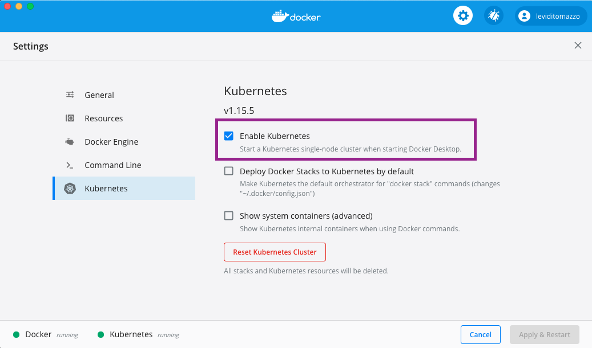

# Kubernetes, Istio e OPA

Essa aplicaçãp foi construida utilizando as seguinstes versões de cada tecnologia

> Istio versão 1.14
> Kubernetes Client Version 1.24.3
> Kubernetes Server Version 1.23.8

## Kubernetes

Habilitando o kubernetes no docker desktop



#### Alternativa

Instalando o minikube [Link](https://kubernetes.io/docs/tasks/tools/install-minikube/)

**Iniciando o minikube**
```bash
minikube start --memory=16384 --cpus=4
```

## Istio

Instalando o istioctl Command-line [Link](https://istio.io/latest/docs/setup/getting-started/#download)

```bash
curl -L https://istio.io/downloadIstio | sh -
```

> Após iniciar o cluster kubernetes, execute os comandos abaixo

**Iniciando o istio**

```bash
$ sh init-istio.sh
```

 Verifique se os containers estão rodando ***(READY)*** antes de iniciar os outros containers

```bash
$ watch kubectl get po --all-namespaces
```

### Aplicação

Se estiver usando o minikube, será necessário alterar o arquivo 2-config-map.yaml para o **ip** e **porta** do seu cluster

```yaml
apiVersion: v1
kind: ConfigMap
metadata:
  namespace: on-premise
  name: config-map-graphql
  labels:
    type: middleware
data:
  END_POINT_API_GRAPHQL: http://{CLUSTER_IP}:{PORT}/graphql
```

> Armazenando a porta de entrada do cluster (minikube)

```bash
export INGRESS_PORT=$(kubectl get svc istio-ingressgateway -n istio-system -o jsonpath='{.spec.ports[1].nodePort}')
```

> Alterando o arquivo 2-config-map.yaml (minikube)

```bash
sed -e "s|http://localhost/graphql|http://$(minikube ip):$INGRESS_PORT/graphql|g" 2-config-map.yaml | kubectl apply -f -
```

#### Iniciando a aplicação

```bash
sh init-demo-1.sh
```

```bash
sh init-demo-2.sh
```

Inserindo dados de exemplo

> Se estiver usando o minikube, alterar o ***localhost*** por **$*(minikube ip)***

```bash
curl POST \
  http://localhost:30080/expense \
  -H 'Content-Type: application/json' \
  -d '{
    "idUser": "5000",
    "companyName": "Arcos Dourados",
    "value": 50.01,
    "details": {
        "cardNumber": "4716650221230609",
        "cnpj": "55.474.589/0001-51",
        "timeStamp": 1578243141,
        "mapLocation": "https://p2.trrsf.com/image/fget/cf/640/0/images.terra.com/2020/09/24/maps.JPG"
    }
}'
```

 Viasualizando a aplicação

```bash
open -a "Google Chrome" http://localhost
```

minikube

```bash
open -a "Google Chrome" http://$(minikube ip):$INGRESS_PORT
```

##### Visualizando o dashboard do kubernetes (***sem minikube***)

Implanta o container do dashboard kubernetes
```bash
kubectl apply -f https://raw.githubusercontent.com/kubernetes/dashboard/v2.0.0-beta8/aio/deploy/recommended.yaml
```

Recupera o token de acesso

```bash
kubectl -n kubernetes-dashboard describe secret $(kubectl -n kubernetes-dashboard get secret | grep admin-user | awk '{print $1}')
```

Disponibilizando o dashboard

```bash
kubectl proxy
```

Acesse o [dashboard](http://localhost:8001/api/v1/namespaces/kubernetes-dashboard/services/https:kubernetes-dashboard:/proxy/) informando o token

**Visualizando as ferramentas de observability** 

```bash
istioctl dashboard kiali
```

```bash
istioctl dashboard grafana
```

```bash
istioctl dashboard jaeger
```

```bash
istioctl dashboard prometheus
```

##### Espelhando requisições (Mirroring)

```bash
kubectl apply -f ./istio/Mirroring/1-mirroring-api-graphql.yaml
```

Caso **não** tenha habilitado o mTLS

```bash
kubectl apply -f ./istio/Mirroring/2-destination-rule.yaml
```

Caso tenha habilitado o mTlS
kubectl apply -f ./istio/Mirroring/2-enable-tls-destination-rule.yaml

```bash
export V1_POD=$(kubectl get pod -l app=api-graphql,version=v1 -o jsonpath={.items..metadata.name} -n on-premise) \
&& kubectl logs -f $V1_POD -c api-graphql -n on-premise
```
```bash
export V2_POD=$(kubectl get pod -l app=api-graphql,version=v2 -o jsonpath={.items..metadata.name} -n on-premise) \
&& kubectl logs -f $V2_POD -c api-graphql -n on-premise
```

```bash
while true; \
  do curl -X POST \
    http://localhost/graphql \
    -H 'Content-Type: application/json' \
    -d '{"query":"mutation { simulate(simulation: { \n  interestRate: 1.99, loanAmount: 500.00, days: 20 \n}) {value tax}}"}'; \
  sleep 0.5; echo; \
done
```

##### Stress test

```bash
docker run -e HOST=192.168.0.14 --name k6-loadimpact --rm -i loadimpact/k6:master run - <./test/service-middleware-java.js
```

##### Authz 

```bash
kubectl exec -it {pod_name} -c authz -n on-premise -- /bin/sh
```

```bash
cat /configMap/validate-profile.rego
```

```bash
ultrahook policy http://localhost:30078
```

```bash
kubectl logs -f -c policy-manager -n security {pod_name}
```
